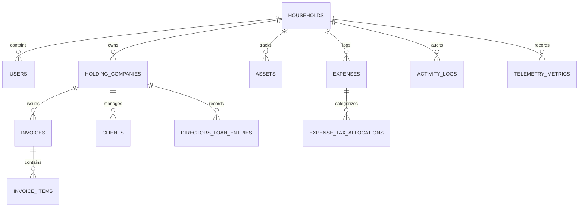

# Breach — Strategic Product & Technical Specification (spec.md)

> **Document Version:** 2.0.0  
> **Status:** Active / Architectural Blueprint  
> **Target Audience:** Product Engineers, Financial Engineers, UI/UX Designers, Tax Compliance Auditors  
> **Governing Standards:** South African Tax Law (SARS ITA & VAT Act)

---

## 1. Executive Summary & Product Vision

**Breach** is an intelligent, high-end Household Asset, Expense Management, and Corporate Tax Optimization web application engineered specifically for South African family offices, founders, high-net-worth individuals, and households that operate an underlying **Holding Company (Pty Ltd or Trust)** structure.

The application bridges the gap between private family life and corporate financial governance. It allows families to track high-value physical assets, monitor domestic and commercial expenses, and dynamically optimize spending classifications between **Holding Company Operational Costs** and **Personal/Household Living Expenses** in strict compliance with South African Revenue Service (SARS) regulations.

Additionally, Breach provides an end-to-end **Holding Company B2B Invoicing Engine** to bill external corporate entities, securing a predictable revenue stream into the holding structure, while capturing deep system telemetry, activity audit trails, and real-time tax efficiency analytics.

```
+----------------------------------------------------------------------------------------------------+
|                                    BREACH UNIFIED PLATFORM                                         |
+----------------------------------------------------------------------------------------------------+
|  [ TOP-BAR NAVIGATION ] Dashboard | Assets | Expenses | Tax Optimizer | Invoices | Telemetry & Logs |
+----------------------------------------------------------------------------------------------------+
|                                                                                                    |
|    +-------------------------------+                      +-----------------------------------+    |
|    |      HOLDING COMPANY          |                      |        HOUSEHOLD / PERSONAL       |    |
|    |  (Pty Ltd / Family Trust)     |                      |       (Directors / Family)        |    |
|    +-------------------------------+                      +-----------------------------------+    |
|    | * SARS Sec 11(a) Deductions   |                      | * Personal Living Costs           |    |
|    | * Section 11(e) Wear & Tear   |  Section 7C & DLA    | * Non-Deductible Spend            |    |
|    | * VAT 201 Input Tax Claims    |<====================>| * Private Asset Register          |    |
|    | * B2B Invoicing to Clients    |  Director's Loan     | * Fringe Benefit Tracking         |    |
|    | * Commercial Assets (Solar/IT)|  Reconciliation      | * Domestic Maintenance            |    |
|    +-------------------------------+                      +-----------------------------------+    |
|                                                                                                    |
|    +------------------------------------------------------------------------------------------+    |
|    |                     INTELLIGENT SARS TAX COMPLIANCE & TELEMETRY ENGINE                   |    |
|    |  * SARS Categorizer  * Apportionment Ratio Calculator  * Real-Time Telemetry & Auditing  |    |
|    +------------------------------------------------------------------------------------------+    |
+----------------------------------------------------------------------------------------------------+
```

---

## 2. Core Pillars & Value Proposition

1. **Dual-Entity Household & Corporate Management**
   - Seamlessly isolates and correlates personal household accounts with holding company business entities under a single unified dashboard.
2. **SARS Tax Optimization & Compliance Engine**
   - Implements intelligent rules for South African Income Tax Act (Act 58 of 1962) and Value-Added Tax Act (Act 89 of 1991), automatically classifying expenses into deductible business trade costs, apportioned hybrid costs, fringe benefits, or private drawings.
3. **Director's Loan Account (DLA) & Section 7C Governor**
   - Actively monitors loan account balances between directors and the holding company, preventing punitive Section 7C deemed interest donations tax and deemed dividend penalties (Section 64E).
4. **Holding Company Invoicing & Income Securitization**
   - Built-in compliant South African Tax Invoice creator to bill external corporate clients, track receivables, apply 15% VAT rules, and maintain active trading revenue into the holding company.
5. **Ultra-Streamlined Top-Bar Interface with Holistic Entity View**
   - Maximize screen real estate on desktop and mobile by eliminating bulky vertical sidebars and hosting top-level navigation in a responsive top bar.
   - Presents a holistic unified view of all household, trust, and holding company assets/expenses with distinct visual entity badges (no jarring entity context switching).
6. **Embedded Telemetry, Auditing & Financial Analytics**
   - System telemetry (D1 latency, R2 sync, OCR scan performance), real-time audit logs, and tax efficiency analytics embedded directly into the central Dashboard screen.
7. **Fairtree Luxury Design System**
   - Architectural, dark-mode first design adhering to strict zero border-radius (`border-radius: 0px`), brand orange/coral accents, and high-contrast typography.

---

## 3. South African Tax Law Compliance Framework

Breach embeds core rules derived from the South African Revenue Service (SARS) guidelines:

```
                                  EXPENSE INCURRED
                                         |
                                         v
                    +------------------------------------------+
                    |  Incurred in the production of income    |
                    |   for the Holding Company trade? (s11a)  |
                    +--------------------+---------------------+
                                         |
                        +----------------+----------------+
                        | YES                             | NO
                        v                                 v
        +-------------------------------+  +--------------------------------+
        | Dual / Mixed Use Purpose?     |  | Purely Private / Domestic      |
        | (Home Office, Vehicle, Telco) |  | Living Expense? (s23g)         |
        +---------------+---------------+  +---------------+----------------+
                        |                                  |
            +-----------+-----------+                      v
            | YES                   | NO           +------------------------+
            v                       v              | Personal Spend /       |
    +---------------+       +---------------+      | Director's Loan Draw   |
    | Apportionment |       | 100% Corp     |      | (Section 7C Governed)  |
    | Formula Apply |       | Deduction     |      +------------------------+
    +---------------+       +---------------+
```

### 3.1 Section 11(a) General Deduction Formula

- **Criterion:** Expenditure and losses actually incurred in the Republic in the production of income, not of a capital nature.
- **Application in Breach:** Validated business operational expenses (consulting software, commercial insurance, professional fees, hosting, holding company administrative overhead) are classified as 100% corporate tax deductible, reducing 27% Corporate Income Tax (CIT).

### 3.2 Section 23(g) Trade Limitation & Dual-Use Apportionment

- **Criterion:** Prohibits deduction of expenses not laid out or expended for the purposes of trade.
- **Application in Breach:**
  - **Home Office:** Calculates square meter allocation ratio $(\text{Dedicated Office Area} / \text{Total Household Area})$ against utility bills, fiber internet, rates, and building insurance.
  - **Business Travel & Vehicles:** Integrates SARS-compliant electronic logbook tracking $(\text{Business km} / \text{Total km})$ to apportion vehicle operational expenses and wear-and-tear allowances.

### 3.3 Section 11(e) Wear and Tear / Depreciation Allowance

- **Criterion:** Capital allowances for assets used in trade based on SARS Interpretation Note 47 write-off periods.
- **Application in Breach:**
  - Personal Computers & Laptops: 3-year straight line (33.3% p.a.).
  - Solar PV & Battery Systems: Section 12B/12BA allowances or 5-year accelerated corporate schedules.
  - Cellular Equipment: 2-year straight line (50% p.a.).

### 3.4 Director's Loan Accounts (DLA) & Section 7C

- **Criterion:** Low-interest or interest-free loans between connected persons/trusts and companies trigger deemed donations tax (20% on interest shortfall below official repo + 100 bps rate) or deemed dividend tax.
- **Application in Breach:** Real-time ledger tracks whenever holding company funds pay for personal domestic expenses (debit to Director's Loan) or personal funds settle holding company bills (credit to Director's Loan), alerting directors before year-end to settle or accrue compliant interest rates.

### 3.5 VAT Act (Act 89 of 1991) Section 20(4) Tax Invoicing

- **Criterion:** Formal requirements for full Tax Invoices.
- **Application in Breach:** All generated invoices mandate:
  - The words "TAX INVOICE" in a prominent place.
  - Holding Company name, address, and VAT registration number (if registered).
  - Recipient entity name, address, and VAT registration number.
  - Serialized unique invoice number and date of issue.
  - Detailed description of services/goods rendered.
  - Clear breakdown of 15% Standard Rated VAT, Zero-Rated, or Exempt amounts and total in ZAR.

---

## 4. Functional Specifications & Modules

### 4.1 Module 1: Household & Corporate Asset Management

Manage physical, tangible, and high-value capital assets across the domestic estate and holding company.

- **Asset Profiles:** Name, category, serial number, purchase date, acquisition cost, current replacement value, warranty expiry, insurance policy reference.
- **Ownership Tagging:** Clear toggle between `Holding Company Owned`, `Trust Owned`, and `Privately Owned`.
- **Wear-and-Tear Calculator:** Automated annual depreciation schedules aligned with SARS asset lifespan tables.
- **Vehicle & Mobility Hub:**
  - Odometer & mileage logbook logging for business vs private trips.
  - Fuel expense logging, service record history, tyre replacement intervals, and license disk renewals.
- **Smart Infrastructure:** Solar PV generation, battery storage capacity, borehole/water filtration, home automation, and smart security systems.

### 4.2 Module 2: Expense Tracking & Smart Categorization

Track domestic, personal, and corporate expenditures with real-time tax optimization.

- **Multi-Source Capture:** Manual entry, CSV bank statement import (FNB, Standard Bank, Nedbank, Investec, Discovery, Capitec), and receipt upload.
- **AI OCR Receipt Scanner:** Cloudflare R2 object storage paired with OCR parser to extract merchant, date, VAT number, line items, and amount.
- **SARS Tax Classification Engine:**
  - `Holding Co - 100% Tax Deductible (Trade)`
  - `Holding Co - Apportioned Business / Private`
  - `Personal - Living Expense (Non-Deductible)`
  - `Personal - Director's Loan Withdrawal`
  - `Capital Expenditure (Section 11(e) Asset)`
- **Voucher / Receipt Vault:** Strict attachment of compliant tax invoices to ensure SARS audit readiness for 5-year statutory retention periods.

### 4.3 Module 3: Holding Company Invoicing Engine

Enable the holding company to invoice external corporate entities, clients, or subsidiaries to formalize management fees, consulting, software licensing, or director services.

- **Client Management:** Corporate directory of external entities, tax numbers, contact persons, and payment terms (Net 15, Net 30, COD).
- **Invoice Builder:**
  - Multi-line item editor with quantity, unit rate, and VAT applicability.
  - Dynamic calculations for Subtotal, 15% VAT, and Total (ZAR).
  - Custom bank payment details (SWIFT/BIC, Account Number, Branch Code, Reference format).
- **Invoice Lifecycle:** `Draft` -> `Issued / Sent` -> `Partially Paid` -> `Settled` -> `Overdue` -> `Void`.
- **Automated PDF Export & Email Delivery:** Printable and downloadable PDFs strictly styled in sharp-corner typography.
- **Recurring Schedules:** Automated generation of monthly retainer invoices for ongoing corporate client engagements.

### 4.4 Module 4: Top-Bar Navigation & Holistic Unified View

The entire navigation paradigm is anchored to a sleek, modern Top Navigation Bar across desktop and mobile displays to allocate 100% of the canvas to data and workflows.

- **Top Bar Structure (Desktop):**
  - **Left Section:** Brand Mark (`BREACH`), Global Quick Search trigger (`⌘K`).
  - **Center Section:** Primary Nav links with active underline indicator (`Dashboard`, `Assets`, `Expenses`, `Tax Optimizer`, `Invoices`, `Settings`).
  - **Right Section:** Quick "+ New" Action Menu (`+ Expense`, `+ Asset`, `+ Invoice`), Notification Center, User Profile dropdown.
- **Top Bar Structure (Mobile):**
  - Compact header with Brand Logo, Quick Scan action, and Hamburger Drawer trigger for secondary items.
- **Holistic Unified View (Zero Entity Swapping):** Rather than forcing the user to toggle or swap between different company and household profiles, all screens provide a comprehensive holistic view displaying clear visual entity badges (e.g. `[Holding Co: Fairtree Assets Pty Ltd]`, `[Personal Household]`, `[Family Trust]`) on every asset, transaction, and invoice.
- **Zero Lateral Obstruction:** No persistent left or right sidebars, ensuring full-width multi-column data tables, side-by-side tax comparisons, and analytics charts.

### 4.5 Module 5: Embedded Dashboard Telemetry, Activity Audit Trail & Financial Analytics

Provide deep transparency and operational intelligence directly on the main Dashboard screen without requiring external navigation.

- **Embedded Real-Time Telemetry:**
  - Database query latency (D1/SQLite).
  - AI OCR parsing speed and optical character confidence scores.
  - Object storage (R2) sync statuses.
- **Immutable Audit Trail:**
  - Timestamped records of every expense created, category altered, asset revalued, invoice sent, or Director's Loan adjustment made.
  - Actor identification (e.g. `Admin`, `Spouse`, `Accountant`).
- **Interactive Financial & Tax Analytics:**
  - **Holding Company Tax Shield Widget:** Total Rands saved in CIT via verified deductions (27% CIT).
  - **Section 7C Risk Index:** Live gauge of Director's Loan debt with projected interest exposure.
  - **Corporate vs. Personal Spend Ratio:** Pie and trend charts tracking corporate lean spend vs household draw.
  - **Revenue Invoiced vs. Realized Cashflow:** Monthly tracking of external client billings.

---

## 5. System Architecture & Technical Stack

```
+-----------------------------------------------------------------------------+
|                             CLIENT / BROWSER                                |
|  * Svelte 5 (Runes: $state, $derived, snippets)                             |
|  * TailwindCSS v4 + Fairtree layout.css (Sharp Corners)                     |
|  * Top-Bar Responsive Navigation Engine                                     |
+-----------------------------------------------------------------------------+
                                      |
                                      v HTTPS / JSON / SSR
+-----------------------------------------------------------------------------+
|                   CLOUDFLARE WORKERS (SvelteKit Edge Runtime)               |
|  * Request Routing & Better-Auth Middleware                                 |
|  * SARS Tax Optimization Engine & Apportionment Calculators                 |
|  * Invoicing Engine & PDF Renderer                                          |
|  * Telemetry Aggregator & Event Logger                                      |
+-----------------------------------------------------------------------------+
        |                              |                              |
        v                              v                              v
+------------------+          +------------------+          +-----------------+
|  CLOUDFLARE D1   |          |  CLOUDFLARE R2   |          | WORKERS AI /    |
|  (SQLite DB)     |          | (Receipt Bucket) |          | OCR PARSER      |
|  * Drizzle ORM   |          | * Invoices & Slips|         | * Document Scan |
+------------------+          +------------------+          +-----------------+
```

### 5.1 Technology Components

- **Language & Runtime:** TypeScript, SvelteKit on Cloudflare Workers edge adapter.
- **State Management:** Strict Svelte 5 Runes (`$state`, `$derived`, snippets). No legacy Svelte stores.
- **Database & ORM:** Cloudflare D1 (Serverless SQLite) with Drizzle ORM schema migrations.
- **Object Storage:** Cloudflare R2 (`RECEIPTS_BUCKET`) for cryptographic storage of invoices and receipts.
- **Authentication:** Better-Auth with SQLite session management, Argon2 password hashing, and role-based permissions.
- **Build System:** Vite+ (`vp`) toolchain with Oxlint and Oxfmt.
- **Icons:** `@lucide/svelte` exclusively.

---

## 6. Database Schema & Entity Relationships (Drizzle ORM)



### 6.1 Database Tables Overview

| Table Name                | Primary Purpose                                      | Key Fields                                                                                                                                  |
| :------------------------ | :--------------------------------------------------- | :------------------------------------------------------------------------------------------------------------------------------------------ |
| `households`              | Core multi-tenant household container                | `id`, `name`, `currency` (ZAR), `created_at`                                                                                                |
| `users`                   | Authenticated family members, directors, accountants | `id`, `household_id`, `name`, `email`, `role`                                                                                               |
| `holding_companies`       | Corporate legal entities (Pty Ltd / Trust)           | `id`, `household_id`, `legal_name`, `registration_number`, `vat_number`, `tax_number`, `bank_details`                                       |
| `clients`                 | External corporate customers billed by holding co    | `id`, `holding_company_id`, `company_name`, `vat_number`, `contact_email`, `address`                                                        |
| `invoices`                | B2B tax invoices issued to external entities         | `id`, `holding_company_id`, `client_id`, `invoice_number`, `issue_date`, `due_date`, `status`, `subtotal`, `vat_amount`, `total_amount`     |
| `invoice_items`           | Individual line items on an invoice                  | `id`, `invoice_id`, `description`, `quantity`, `unit_price`, `vat_rate`, `line_total`                                                       |
| `assets`                  | High-value domestic and corporate asset register     | `id`, `household_id`, `holding_company_id`, `name`, `category`, `ownership_type`, `purchase_price`, `current_value`, `sars_write_off_years` |
| `expenses`                | Household and holding company expenditure items      | `id`, `household_id`, `holding_company_id`, `asset_id`, `date`, `merchant`, `amount`, `receipt_r2_key`, `payment_method`                    |
| `expense_tax_allocations` | SARS classification and apportionment breakdown      | `id`, `expense_id`, `tax_category`, `deductible_percentage`, `corporate_deduction_amount`, `personal_amount`, `vat_claimable`               |
| `directors_loan_entries`  | Running ledger tracking company-paid personal costs  | `id`, `holding_company_id`, `user_id`, `expense_id`, `type` (DEBIT/CREDIT), `amount`, `description`, `date`                                 |
| `activity_logs`           | Immutable audit trail for user operations            | `id`, `household_id`, `user_id`, `action`, `resource_type`, `resource_id`, `metadata`, `ip_address`, `timestamp`                            |
| `telemetry_metrics`       | System performance, OCR speed, latency telemetry     | `id`, `metric_name`, `duration_ms`, `success`, `details`, `timestamp`                                                                       |

---

## 7. Fairtree Brand Design System & UI Specifications

All visual surfaces in Breach MUST strictly adhere to the Fairtree Brand Guidelines.

### 7.1 The Golden Rule of Sharp Corners (Zero Border-Radius)

- **Mandatory:** `border-radius: 0px` across ALL interactive and layout elements (`buttons`, `inputs`, `selects`, `cards`, `modals`, `tables`, `badges`, `tooltips`, `dropdowns`, `images`).
- Any appearance of standard Tailwind rounded classes (`rounded`, `rounded-lg`, `rounded-full`) is strictly forbidden.

### 7.2 Color Tokens

| Color Name               | Hex / Variable                                | Purpose                                                          |
| :----------------------- | :-------------------------------------------- | :--------------------------------------------------------------- |
| **Dark Background**      | `#121215` (`--color-dark-bg`)                 | Base application dark canvas                                     |
| **Dark Surface**         | `#1a1a1e` (`--color-dark-surface`)            | Top-bar header, container cards, modal dialogs                   |
| **Dark Card**            | `#222227` (`--color-dark-card`)               | Nested asset cards, metric tiles, table rows                     |
| **Border Dark**          | `#2e2e36` (`--color-dark-border`)             | Crisp, 1px structural separation lines                           |
| **Brand Orange / Coral** | `#cb6423` / `#ff6f61` (`--color-coral`)       | Primary interactive buttons, active tab underlines, focal badges |
| **Brand Orange Hover**   | `#b5551b` / `#e05a4c` (`--color-coral-hover`) | Button hover and focus states                                    |
| **Badge Teal**           | `#177f99` (`--color-badge-teal`)              | Category badges, vehicle status, active telemetry pings          |
| **Success Emerald**      | `#22c55e` (`--color-success`)                 | Compliant deductions, paid invoices, healthy metrics             |
| **Warning Amber**        | `#f59e0b` (`--color-warning`)                 | Section 7C threshold warnings, pending invoices                  |
| **Text Main**            | `#f0f0f5` (`--color-text-main`)               | Crisp white/off-white primary text                               |
| **Text Muted**           | `#9a9ab0` (`--color-text-muted`)              | Metadata, table headers, descriptions                            |

### 7.3 Typography Hierarchy

- **Primary Serif:** `RecifeDisplay` / `Playfair Display` (Weight: Bold) — Page headers, currency figures, KPI metrics, brand headers.
- **Primary Sans-Serif:** `Raleway` / `Inter` (Weight: 400, 500, 600, 700) — Top-bar navigation items, form inputs, buttons, data grids.
- **Monospace:** `JetBrains Mono` / `Fira Code` — Serial numbers, VAT registration numbers, telemetry logs, JSON audit records.

---

## 8. User Experience & Screen Workflows

### 8.1 Top-Bar Experience & Viewport Maximization

```
+--------------------------------------------------------------------------------------------------------------------+
| [BREACH] | Holding Co: Fairtree Assets (Pty) Ltd v |  Dashboard  Assets  Expenses  Tax-Optimizer  Invoices  Logs  | [R2: OK]  [+ New v]  [User v] |
+--------------------------------------------------------------------------------------------------------------------+
|                                                                                                                    |
|  EXECUTIVE DASHBOARD (Full Screen Canvas)                                                                           |
|                                                                                                                    |
|  +---------------------+  +---------------------+  +---------------------+  +---------------------+                |
|  | TOTAL ASSETS (ZAR)  |  | HOLDING CO EXPENSES |  | TAX SHIELD (SAVED)  |  | INVOICED REVENUE    |                |
|  | R 28,450,000        |  | R 142,800 / mo      |  | R 38,556 (27% CIT)  |  | R 180,000 / mo      |                |
|  +---------------------+  +---------------------+  +---------------------+  +---------------------+                |
|                                                                                                                    |
+--------------------------------------------------------------------------------------------------------------------+
```

- **Instant Switching:** Clicking the top-bar entity selector toggles views between `Consolidated Household`, `Holding Company Only`, and `Private Personal Only`.
- **Keyboard Shortcut Support:** `⌘K` / `Ctrl+K` opens the quick omnibox to jump directly to any asset, invoice, or expense slip.

### 8.2 Intelligent Expense Entry Workflow

1. User clicks `+ Expense` in the top bar or drops a receipt photo onto the canvas.
2. System uploads receipt to Cloudflare R2 and triggers OCR parsing.
3. Telemetry records OCR response time and character recognition confidence.
4. The **SARS Tax Engine** suggests classification:
   - _Example:_ "Fiber Internet Invoice (R 1,500)" -> Suggests _Dual-Use Home Office (50% Corporate / 50% Personal)_ based on registered office profile.
5. User confirms or overrides; DLA ledger updates immediately if company funds paid for personal share.

### 8.3 Corporate Invoicing Workflow

1. User navigates to `Invoices` in the top bar.
2. Selects an existing corporate client or creates a new client with a valid SARS VAT number.
3. Adds line items (e.g. _Management Consulting Services - August 2026_, Qty: 1, Rate: R 85,000).
4. System automatically computes 15% VAT (R 12,750) and Total (R 97,750).
5. User clicks `Issue Invoice`; unique serial invoice number is stamped (`INV-2026-0042`), immutable audit event is logged, and a clean sharp-corner PDF is generated ready for dispatch.

---

## 9. Security, Privacy & Compliance (POPIA / SARS)

- **POPIA (Protection of Personal Information Act, South Africa):** All family personal data, tax reference numbers, and financial statements are strictly encrypted at rest and in transit.
- **Multi-Factor Authentication (MFA):** Mandatory TOTP MFA for administrative and corporate director accounts.
- **Audit Immutability:** Audit records are append-only. Deleted or adjusted expense items retain historical revision logs for 5 years to satisfy SARS audit inspection criteria.
- **Tenant Isolation:** D1 queries enforce rigid `household_id` and `holding_company_id` parameterized isolation preventing any cross-tenant data leakage.

---

## 10. Verification & Quality Assurance Standards

To maintain compliance and robustness, all code contributions must pass the following QA gates:

1. **Brand & Style Validation:** Automated CSS checks verifying that zero rounded corners exist in DOM nodes (`border-radius === 0px`).
2. **Tax Engine Unit Tests:** Comprehensive Vitest test suite covering:
   - Section 11(a) deduction validations.
   - Home office and vehicle logbook apportionment formulas.
   - Section 7C deemed interest calculation matrices against South African repo rates.
   - 15% South African VAT calculation precision (rounding half up to 2 decimal places).
3. **End-to-End Test Suite (Playwright):**
   - Full top-bar navigation flow on desktop (1920x1080) and mobile viewports (390x844).
   - Invoicing generation, line item calculation, and status change workflow.
   - Receipt upload to R2, OCR ingestion, and telemetry logging verification.
4. **Linting & Code Quality:** Zero oxlint warnings, zero type errors (`vp check`), clean Svelte 5 runes compliance.

---

_This document serves as the master specification for Breach. All future architectural pull requests, database migrations, and UI expansions must align directly with the guidelines and specifications contained herein._
